::: center

**UNIVERSIDAD DE INVESTIGACIÓN DE TECNOLOGÍA EXPERIMENTAL YACHAY**\
\
\
Trabajo de titulación presentado como requisito para la obtención del
título de Magíster en Inteligencia Artificial\
:::

#  Autoría {#chap:autoria .unnumbered}

Yo, **Omar**, con cédula de identidad 1003712666, declaro que las ideas,
juicios, valoraciones, interpretaciones, consultas bibliográficas,
definiciones y conceptualizaciones expuestas en el presente trabajo; así
cómo, los procedimientos y herramientas utilizadas en la investigación,
son de absoluta responsabilidad de el autor del trabajo de integración
curricular. Así mismo, me acojo a los reglamentos internos de la
Universidad de Investigación de Tecnología Experimental Yachay.

Urcuquí, Septiembre 2025.

::: center

------------------------------------------------------------------------

\
Wilman Roberto Suárez Zambrano\
CI: 1003712666
:::

#  Autorización de publicación {#chap:autorizacion .unnumbered}

Yo, **Wilman Roberto Suárez Zambrano**, con cédula de identidad
1003712666, cedo a la Universidad de Investigación de Tecnología
Experimental Yachay, los derechos de publicación de la presente obra,
sin que deba haber un reconocimiento económico por este concepto.
Declaro además que el texto del presente trabajo de titulación no podrá
ser cedido a ninguna empresa editorial para su publicación u otros
fines, sin contar previamente con la autorización escrita de la
Universidad.

Asimismo, autorizo a la Universidad que realice la digitalización y
publicación de este trabajo de integración curricular en el repositorio
virtual, de conformidad a lo dispuesto en el Art. 144 de la Ley Orgánica
de Educación

Urcuquí, Septiembre 2025.

::: center

------------------------------------------------------------------------

\
Wilman Roberto Suárez Zambrano\
CI: 1003712666
:::

#  Dedication {#chap:dedication}

::: center
To Anita María, Clarisse and Josué.
:::

::: flushright
Wilman Roberto Suárez Zambrano
:::

#  Acknowledgment {#chap:acknowledgments}

To God, for granting me everything.\
To Zenaida, your support has been invaluable.\
To Juan Pablo, for your assistance and dedication to this work.\
To my family, thank you for your constant support.\
To my professors from the Master's program.\
To my colleagues at ECMC (\...).\
To all of you, my deepest gratitude.

::: flushright
Wilman Roberto Suárez Zambrano
:::

#  Resumen {#chap:resumen}

**Palabras Clave**:\
Mobile Ad hoc Networks; Disaster communications; Machine Learning;
CatBoost; Packet Delivery Ratio; ns-3 simulation; Quality of service;

#  Abstract {#chap:abstract}

**Keywords**:\
Mobile Ad hoc Networks; Disaster communications; Machine Learning;
CatBoost; Packet Delivery Ratio; ns-3 simulation; Quality of service;

# Introduction {#chap:intro}

## Antecedentes

Holaaaaaaaaa

### Antecedente 1

Holaaa

## Background

Over the past decade, the frequency and severity of disasters---such as
major earthquakes, hurricanes, wildfires, and attacks on critical
infrastructure---has risen markedly, disabling conventional
telecommunications networks within minutes [@shaaban2023audio]

[@Alexander2013; @FCC2023]. In the absence of this infrastructure,
rescue teams require rapid, self-sufficient solutions that allow them to
coordinate operations, share aerial imagery, and transmit sensor data.
**Mobile Ad Hoc Networks (MANETs)** have emerged as an ideal
alternative: each device acts simultaneously as an end node and a
router, forming a self-organising mesh that operates without towers or
backbone links [@Corson1999]. Field trials conducted after the 2017
Puebla earthquake showed that a MANET of 60 handheld radios restored
basic voice and messaging services in under thirty minutes, although it
suffered from latency and packet-loss issues caused by chaotic mobility
and signal shadowing from collapsed buildings [@Garcia2020].

In response to these limitations, the scientific community has
incorporated **artificial intelligence** (AI) techniques into the
protocol stack. Machine-learning models can predict link breakages,
balance traffic load, and adjust transmission power in real time
[@Mao2018; @Sun2020]. Deep-reinforcement-learning algorithms have
outperformed classical routing schemes by anticipating network
fragmentation and proactively rerouting data flows [@Jin2024].
Unsupervised methods---such as *k-means* clustering---group nearby nodes
and reduce signalling overhead when the network becomes dense and
heterogeneous [@Suh2025]. However, many of these studies rely on
synthetic mobility patterns that overlook the actual dynamics of
affected populations, potentially leading to overly optimistic
quality-of-service estimates [@Mahiddin2021].

To close this realism gap, researchers have developed **data-driven
mobility models** and high-fidelity simulators. The *Disaster Area
Mobility Model* (DA-MM) in BonnMotion reproduces the movement of victims
and rescuers through rubble zones, shelters, and command posts
[@Aschenbruck2010]. When combined with Carpenter and Sichitiu's
obstacle-shadowing model in `ns-3`, DA-MM corrects packet-delivery
overestimation by accounting for the attenuation caused by concrete
blocks and collapsed structures [@Carpenter2015]. Recent studies have
incorporated real evacuation traces---such as those collected during
Hurricane Ian in 2022---showing that mobility surges can triple network
congestion in less than two hours [@Liu2025]. Meanwhile, the European
guidelines for trustworthy AI underscore the need for transparency,
fairness, and robustness---factors that are critical when network
decisions can directly affect human safety [@EC_HLEG2019].

In summary, the convergence of **MANETs, realistic simulation, and AI
algorithms** points the way to networks capable of sustaining vital
communications when conventional means fail. Nonetheless, important
challenges remain: training models with data that truly represent
critical scenarios, ensuring an ethical and explainable operation, and
validating---at least in simulation or laboratory settings---that the
proposed solutions reduce latency and packet loss without overloading
frontline devices. This study tackles these issues and lays the
groundwork for future field trials, once the initial simulation or lab
stages have demonstrated their effectiveness.

## Problem statement

Natural and human-made disasters---such as earthquakes, floods,
wildfires, or targeted attacks on critical infrastructure---can disable
conventional telecommunications networks in a matter of minutes. When
this disruption occurs, rescue teams are left without reliable channels
to coordinate operations, share aerial imagery, report victim locations,
or transmit sensor data that warns of aftershocks and fire hotspots. In
the absence of fixed infrastructure, *ad hoc* networks emerge as the
immediate alternative: each device acts simultaneously as an end node
and a router, forming self-organising meshes that can be deployed within
minutes. Nevertheless, rapidly changing topology, radio-frequency
interference, and device heterogeneity lead to high latencies and packet
losses that undermine the usefulness of the transmitted information.

To mitigate these limitations, two essential challenges must be
addressed: **(i)** dynamically and robustly selecting routes in highly
mobile and fragmented environments, and **(ii)** adapting spectrum
access under adverse conditions of interference and obstacles.
Machine-learning techniques offer a promising framework because they can
uncover connectivity patterns and anticipate link breakages using
historical data and realistic simulations. The aim of this thesis is
therefore to implement and validate a *machine-learning* model that,
when trained with data representative of disaster scenarios, proves its
ability to reduce latency and packet loss without significantly
increasing control signalling. In doing so, it seeks to improve the
quality of service of *ad hoc* networks precisely when they are needed
the most---after conventional infrastructure has failed.

## Objectives

### General Objective

Implement machine learning models to optimize data transmission in
disaster scenarios with ad-hoc networks. This approach aims to minimize
latency and packet loss (while improving throughput), ensuring the
efficient transmission of information, especially under disaster
conditions.

### Specific Objectives

1.  Conduct a comprehensive literature review on the current state of
    wireless communications in disaster scenarios. This review will help
    identify existing limitations and highlight opportunities where
    artificial intelligence can enhance network performance.

2.  Collect a dataset that characterizes communication behavior in
    disaster scenarios using mobility and wireless network simulators.
    This dataset will serve as a foundational input for designing and
    training machine learning models tailored to emergency environments.

3.  Preprocess the collected data to extract suitable input and output
    features for the machine learning model. This step includes feature
    selection, data normalization, and organization to ensure optimal
    learning and model efficiency.

4.  Select and train a machine learning model that improves key
    performance metrics such as *Accuracy* and *F1-Score*. For this
    purpose, the architecture of a supervised algorithm will be found
    using hyperparameter optimisation algorithms.

5.  Simulate and validate the trained model in realistic disaster
    scenarios using metrics such as packet delivery ratio and end-to-end
    delay. These simulations will assess the model's real-world impact
    on the quality of service (QoS) in ad hoc wireless networks under
    challenging conditions.

# Theoretical Framework {#chap:theory}

This chapter lays the conceptual groundwork for the thesis: it first
outlines the principles of wireless networks operating in disaster
situations, then discusses the mobility models and simulation tools that
replicate those environments, and finally reviews recent Machine
Learning contributions aimed at improving communication performance in
*ad-hoc* networks.

En la figura [6.1](#fig:audiofig){reference-type="ref"
reference="fig:audiofig"} dice esto

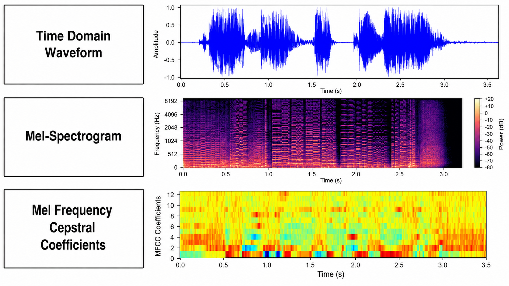{#fig:audiofig width="50%"}

*Ad-hoc* networks are viewed as the fastest way to restore
communications when conventional infrastructure is out of service. Their
performance, however, depends on factors such as unpredictable human
movement, the presence of obstacles, and environmental interference. To
capture these conditions realistically, the research community combines
disaster-specific mobility models---most notably BonnMotion's *Disaster
Area Mobility Model*---with discrete-event simulators like `ns-3`, to
which obstacle-attenuation or shadow-fading models can be coupled
[@Aschenbruck2010; @Mahiddin2021; @Carpenter2015].

In recent years, **Machine Learning techniques** have been explored to
enable the network to adapt autonomously to changing topologies. Several
studies show that models trained on simulated or field data help select
more stable routes, adjust medium-access parameters, and prioritise
critical flows---all without human intervention [@Jin2024]. These
approaches give the network a self-organising character, capable of
redistributing resources whenever conditions become adverse, although
they still depend on the quality of the training data and the fidelity
of the simulated environment [@Suh2025].

## Mobile Ad Hoc Networks (MANETs)

### Definition and General Characteristics

**Mobile Ad Hoc Networks (MANETs)** are decentralised wireless
communication systems composed of mobile nodes that communicate with one
another without any fixed infrastructure or central administration. Each
node acts simultaneously as a host and a router, enabling data to be
forwarded through multiple hops between nodes that are not within direct
transmission range.
**Figure [6.2](#fig:manet_example){reference-type="ref"
reference="fig:manet_example"}** illustrates a typical MANET topology
and the multi-hop cooperation among nodes.

<figure id="fig:manet_example" data-latex-placement="h!">
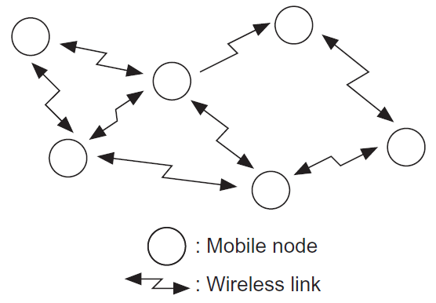
<figcaption>Example of a MANET topology .</figcaption>
</figure>

These networks are characterised by their ability for
**self-organisation**, **self-configuration**, and **self-healing**,
which makes them especially useful in dynamic or unpredictable
environments where conventional infrastructure deployment is not
feasible. Such scenarios include military operations, areas affected by
natural disasters, intelligent vehicular networks, and temporary
deployments at large-scale events [@Datta2012].

Thanks to their flexibility and adaptability, MANETs have been widely
studied in the academic community and remain an active research area,
particularly in the development of efficient and secure routing
protocols.

The main characteristics of Mobile Ad Hoc Networks (MANETs) include:

- **Variable-capacity wireless links**: Nodes communicate over wireless
  links whenever they are within mutual coverage range. These links can
  exhibit different capacities because nodes may carry multiple radio
  interfaces operating on various frequency bands and offering distinct
  transmission and reception capabilities.

- **Mobility and dynamic topology**: Nodes can move freely, causing
  continuous changes in network connectivity. Some nodes may be highly
  mobile---for example, a device in a moving vehicle---whereas others
  may remain relatively static. This results in a dynamic topology in
  which nodes can join or leave the system at any time.

- **Self-organisation, self-configuration, and autonomy**: The network
  is created, managed, and adapted dynamically by the nodes themselves,
  without external intervention or the need for centralised
  administration or fixed infrastructure. This includes the
  self-configuration of essential parameters such as addressing,
  routing, position identification, and power control.

- **No fixed infrastructure or central administrator**: MANETs do not
  require access points, central routers, or servers to operate. This
  enables rapid deployment, particularly in environments where
  traditional infrastructure is unavailable or has been destroyed.

- **Collaboration among nodes**: Each node functions not only as a
  sender and receiver but also as a router, forwarding packets that are
  not addressed to itself. This cooperation is essential for maintaining
  connectivity and overall network operation in the absence of dedicated
  routing nodes.

- **Resource and energy constraints**: Nodes in a MANET are typically
  battery-powered mobile devices with limited processing, storage, and
  bandwidth capabilities. These restrictions critically influence the
  design of algorithms and protocols, which must be highly efficient in
  both energy consumption and resource utilisation.

- **Heterogeneity**: Devices that make up a MANET can be highly
  diverse---such as smartphones, laptops, tablets, or sensors---each
  with different hardware capabilities, energy reserves, and mobility
  patterns.

## Most Common Topologies

MANETs can assume various configurations depending on the placement and
mobility of their nodes. Understanding these topologies is crucial for
designing efficient routing protocols and control mechanisms. The three
most common arrangements are described below and illustrated in
Figures [6.3](#fig:topo_lineal){reference-type="ref"
reference="fig:topo_lineal"},
[6.4](#fig:topo_malla){reference-type="ref" reference="fig:topo_malla"},
and [6.5](#fig:topo_estrella){reference-type="ref"
reference="fig:topo_estrella"}.

### Linear Topology

The linear arrangement
([6.3](#fig:topo_lineal){reference-type="ref+label"
reference="fig:topo_lineal"}) occurs when nodes are aligned---for
instance, along an underground corridor, a vehicular tunnel, or a line
of rescuers advancing through a narrow hallway. Its main limitation is
sequential dependency: the failure of an intermediate node can interrupt
communication between the endpoints, increasing latency because
alternative routes must be established.

<figure id="fig:topo_lineal" data-latex-placement="h!">
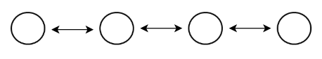
<figcaption>Typical linear topology in MANETs.</figcaption>
</figure>

### Mesh Topology

The mesh structure ([6.4](#fig:topo_malla){reference-type="ref+label"
reference="fig:topo_malla"}) provides multiple redundant paths between
pairs of nodes. This increases fault tolerance and facilitates load
balancing, albeit at the cost of greater routing complexity. It is the
preferred configuration in search-and-rescue deployments or UAV swarms
that cover a broad area with uniform density.

<figure id="fig:topo_malla" data-latex-placement="h!">
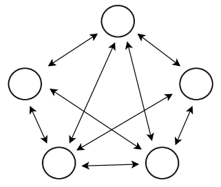
<figcaption>Mesh topology with redundant links.</figcaption>
</figure>

### Star Topology

In the star arrangement
([6.5](#fig:topo_estrella){reference-type="ref+label"
reference="fig:topo_estrella"}), a central node---such as a
high-capacity drone or a command vehicle---acts as a hub and
concentrates all traffic. This topology simplifies routing and reduces
latency toward the centre, but it introduces a single point of failure:
if the central node is compromised, the network fragments.

<figure id="fig:topo_estrella" data-latex-placement="h!">
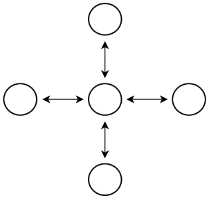
<figcaption>Star topology with a central hub node.</figcaption>
</figure>

### Applications in Emergency Contexts

MANETs prove especially advantageous in disaster
scenarios---earthquakes, hurricanes, or floods---where conventional
infrastructure is out of service. Their self-organising capability
enables emergency teams to re-establish basic communications, transmit
critical data, and extend coverage within minutes, without relying on
backbone links or fixed access points.

**Table [6.1](#tab:manet_apps){reference-type="ref"
reference="tab:manet_apps"}** summarises the most representative domains
in which ad-hoc networks have been deployed or studied and will serve as
a guiding thread for the examples described below.

::: {#tab:manet_apps}
  **Domain**                   **Typical Applications**
  ---------------------------- --------------------------------------------------
  Military                     Tactical communications; autonomous operations
  Emergency Response           Search and rescue; temporary emergency networks
  Scientific / Environmental   Environmental monitoring; precision agriculture
  Education / Entertainment    Virtual classrooms; multi‐user gaming
  Vehicular                    Vehicle‐to‐vehicle communication; traffic alerts
  Commercial                   Mobile offices; e‐commerce on the move

  : Representative application domains of MANETs.
:::

Ad-hoc networks have become a cornerstone for the **rapid restoration of
connectivity** after earthquakes, floods, or complete
cellular-infrastructure blackouts. Field-deployment experiments---for
instance, the **R-RDSP** system built on off-the-shelf Wi-Fi
devices---show that an autonomous mesh can restore basic voice and data
services in under ten minutes and reduce end-to-end delay by $14.5\%$
compared with earlier schemes [@Jan2024]. These plug-and-play
architectures remove the need for root nodes and, thanks to multi-hop
broadcasting, keep rescue teams online when conventional routes
collapse.

A second cornerstone is **dynamic aerial coverage** using swarms of
unmanned vehicles. Chandran and Vipin describe how *multi-UAV FANETs*
extend line-of-sight and relay 4 K video over devastated areas, while
also discussing formation and security challenges [@Chandran2024].
Complementing their work, Li *et al.* propose a multi-objective
deployment algorithm that balances coverage, energy consumption, and
path redundancy; their strategy improves the packet-delivery ratio by
$\uparrow 11\%$ in ns-3 wild-fire simulations [@LiFANET2024]. These
aerial solutions serve as *backhaul* nodes for ground sensors, forming
fault-tolerant hybrid networks.

**Artificial intelligence** has further enhanced these applications by
optimising routing under highly variable conditions. Jin *et al.*
propose *DRLRR*, a resilient routing protocol based on deep
reinforcement learning that, in simulated post-earthquake urban
scenarios, raises the *Packet Delivery Ratio* by 18 % and cuts
end-to-end delay by 22 % compared with AODV [@Jin2024]. Complementarily,
Suh *et al.* combine unsupervised *clustering* with deep RL to reduce
route-update overhead by 30 % when nodes move chaotically [@Suh2025].

Finally, **citizen participation** via *mobile crowdsensing* has
expanded MANET capabilities. A systematic survey by Cicek and Kantarci
reviews 25 studies in which smartphones themselves collect environmental
data, geolocation, or images to enhance the situational awareness of
emergency agencies; the review confirms that, when combined with
intelligent aggregation techniques, these volunteer networks can provide
reliable information with acceptable energy consumption [@Cicek2023].
Thus, disaster‐related applications range from mission‐critical links
for first responders to participatory citizen‐reporting platforms, all
supported by the self‐configurable and increasingly intelligent nature
of ad‐hoc networks.

### Challenges in Highly Dynamic Environments

The main distinctive feature of *ad-hoc* networks in disaster scenarios
is their **highly volatile topology**: links are created and torn down
within milliseconds due to irregular three-dimensional movement, node
loss, and unpredictable obstacles. In UAV scenarios, for instance,
vertical mobility increases the likelihood of partitioning and
multiplies the number of hops required to maintain connectivity
[@Lakew2020]. This volatility triggers bursts of stale routes and
produces reconvergence delays that degrade critical QoS metrics such as
end-to-end delay.

Another challenge is the **signalling overhead**. Recent comparative
studies show that when traffic increases from 5 to 20 pkt/s, the
overhead of reactive protocols surges by up to 65% in 100-node networks,
owing to route-discovery requests and periodic maintenance messages
[@Razouqi2024]. The problem is exacerbated by variable node
densities---such as sudden concentrations of rescuers or emergency
vehicles---which saturate the channel and cause collisions.

**Interference and congestion or *jamming* attacks** add further
uncertainty. A study by Abuzainab *et al.* demonstrates that
interference losses can reduce throughput by as much as 40% even under
moderate mobility levels [@Abuzainab2019]. Effective countermeasures
therefore require adaptive mechanisms capable of identifying free
channels and rebuilding routes in real time.

**Density--time variability** also challenges machine learning: models
must generalise from sparse topologies to dense clusters without
incurring a state‐space explosion. The survey by Zheng *et al.* reports
that RL‐based MAC algorithms struggle to scale once the number of nodes
exceeds one hundred [@Zheng2023]. To mitigate this issue, hybrid
strategies combine unsupervised *clustering* with deep RL, cutting
table‐update overhead by 30% [@Suh2025]. Likewise, in high-speed
vehicular environments, Upadhyay *et al.* employ an enhanced DRL scheme
that lowers average latency and increases PDR even at densities above
120 vehicles/km [@Upadhyay2023].

Finally, **energy constraints and device heterogeneity**---from
low-power sensors to battery-rich UAVs---complicate the selection of
stable and efficient routes. Without dynamic load balancing and power
control, critical nodes deplete their batteries, causing catastrophic
failures in the communication mesh. These challenges underscore the need
for cognitive protocols that integrate mobility, interference, and
energy metrics to keep the network operational under extreme conditions.

### Communication and Routing Protocols

Routing protocols in *ad-hoc* networks are traditionally grouped into
**proactive**, **reactive**, and **hybrid** categories. Proactive
schemes---such as DSDV and OLSR/OLSRv2---maintain full routing tables
and offer low discovery latency, which makes them a common baseline in
disaster-network testbeds and field trials [@Haddad2018]. Their main
drawback is the constant control traffic they generate: comparative
studies under high-mobility simulations show that, at 20 pkt/s,
proactive overhead can exceed that of reactive protocols by about 35 %
[@Razouqi2024]. Hardware-centric enhancements such as HMC-AODV cut
end-to-end delay by up to 25 % through FPGA parallelism and homogeneous
clustering [@Kumar2025], while adaptive variants of OLSR that reduce
"HELLO" frequency have been proposed to make the protocol more suitable
for highly dynamic emergency scenarios [@Anastasi2022].

In disaster contexts, **reactive protocols** (AODV, DSR, DYMO) are
preferred for their low initial overhead. However, their performance
degrades under priority traffic and collision conditions. To address
this, Ozen and Ozen propose **PA-AODV**, which assigns priority levels
to emergency packets and raises the *Packet Delivery Ratio* by 12 % in
ns-3 scenarios with 150 nodes [@Ozen2024]. Jin *et al.* introduce
*DRLRR*, a deep-reinforcement-learning-based scheme that improves PDR by
18 % and shortens latency by 22 % compared with AODV in post-earthquake
environments [@Jin2024].

The rise of **artificial intelligence** has spurred the development of
adaptive routes that react to mobility in real time. Notable examples
include *(i)* **PARRoT**, which combines reinforcement learning with UAV
trajectory prediction and lowers average latency by 17 % [@Sliwa2021];
*(ii)* **QLR‐FANET**, where Q-learning and rate control stabilise highly
mobile aerial links [@Shen2024]; and *(iii)* the resilient protocol by
Suh *et al.*, which applies unsupervised *clustering* before deep RL and
cuts route-update overhead by 30 % in chaotic networks [@Suh2025]. More
recently, Dikmen *et al.* show that a distributed DRL scheme with dense
rewards preserves connectivity in topologies of up to 250 nodes while
sacrificing less than 8 % of throughput compared with the theoretical
optimum [@Dikmen2024].

**Hybrid and multi-domain--aware protocols** integrate interference,
energy, and congestion metrics. Upadhyay *et al.* introduce IDRL-VANET,
which optimises routes and controls collisions in vehicular networks,
achieving latency reductions at densities of $\ge 120$ vehicles/km
[@Upadhyay2023]. These trends point toward cognitive, software-defined
architectures in which ML algorithms operate alongside adaptive MAC/PHY
layers to sustain the resilience required for emergency missions.

### IEEE 802.11e EDCA and QoS Provisioning

The IEEE 802.11e standard---released as an amendment in
2005---introduced the **Enhanced Distributed Channel Access** (EDCA)
mechanism to provide quality of service in WLANs and, by extension, in
*ad-hoc* networks [@IEEE80211e2005]. EDCA extends the legacy Distributed
Coordination Function (DCF) by adding four *Access Categories* (ACs):
voice, video, best effort, and background. Each category has its own
contention parameters---*Arbitration Inter-Frame Space* (AIFS),
minimum/maximum *Contention Window*, and *Transmit Opportunity*
(TXOP)---that prioritise delay-sensitive flows without the need for
central coordination. In disaster contexts, this differentiation is
essential to ensure that rescue-team voice frames or UAV aerial images
receive priority over less critical traffic.

<figure id="fig:Priority_control_scheme_of_EDCA"
data-latex-placement="H">
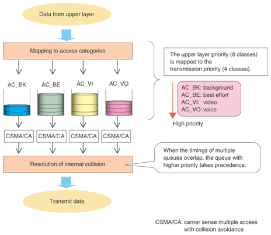
<figcaption>Priority control scheme of EDCA .</figcaption>
</figure>

Early analyses showed that simply configuring EDCA parameters statically
may be insufficient under mixed loads and high mobility. Ni *et al.*
demonstrated that dynamically adjusting the contention-window size
according to traffic type significantly improves latency and video/voice
throughput without harming lower categories [@Ni2005]. Later, Inan
*et al.* developed a cycle‐time--based model that accurately computes
delay and capacity for each category even under saturation, providing a
theoretical foundation for EDCA auto‐tuning algorithms [@Inan2007].

In emergency *ad-hoc* networks, EDCA is often combined with deep
reinforcement learning to reconfigure AIFS and CW according to node
density and interference levels, thus merging the standard's intrinsic
prioritisation with AI-driven adaptability. This synergy makes it
possible to maintain smooth voice service and stable video transmission
even when the topology and radio environment change unpredictably.

## Mobility in Emergency Contexts

The **human factor** shapes every emergency-communications architecture,
since the effectiveness of an *ad-hoc* network depends on the cognitive,
affective, and mobility patterns of the affected population. Recent
studies show that the *intention to evacuate* is dominated by perceived
efficacy of the action and the subjective probability of harm; together,
these factors explain most of the variance in evacuation decisions
during a hurricane [@Morss2024]. This finding supports the *Protective
Action Decision Model* and underscores the importance of messages that
emphasise the benefits of relocating in the face of risk.

Once the decision turns into action, collective dynamics exhibit
*self-organising* behaviour. Multi-exit simulations with agents trained
in urban drills reveal that familiarity with specific exits can
unbalance pedestrian flows, causing bottlenecks and lowering the overall
evacuation efficiency [@Sun2021]. These congestions---combined with the
simultaneous voice and data traffic generated by rescue teams---put
additional stress on the network; therefore, mobility models for MANETs
must account for crowd effects and partial route blockages.

The advent of large-scale *anonymous geolocation* databases has made it
possible to quantify these phenomena in real time. An analysis of more
than 40 million mobile‐device records during Hurricane Ian showed that
departure peaks occur within two hours of an official order, with
spatially heterogeneous evacuation rates---reaching 68 % in coastal
counties but only 23 % in inland areas [@Liu2025]. Such disparities call
for dynamic aerial‐coverage schemes---e.g., FANETs---that can
redistribute capacity where user density multiplies.

Finally, *citizen participation* adds another behavioural layer: more
than 70 % of damage reports in recent earthquakes originate from social
networks or *mobile crowdsensing*. A systematic review identifies 25
studies in which smartphones themselves contribute environmental and
geo-tagged data, showing that intelligent aggregation can deliver
reliable information at acceptable energy costs [@Cicek2023].
Integrating these collaborative data streams into the routing logic
strengthens network resilience and enhances the situational awareness of
authorities.

### Importance of Realistic Mobility Models

Rigorous evaluation of *ad-hoc* networks requires node movements to
accurately reproduce the paths and physical constraints of a disaster
environment. Using random patterns---e.g., the *Random Waypoint*
model---can **overestimate performance**: a comparative study showed
that such models "do not reflect obstacles or the logic of rescue teams,
leading to unreliable results" [@Mahiddin2021]. Indeed, the review
concludes that the *Disaster Area Mobility Model* (DA-MM) yields more
plausible trajectories by incorporating walls, debris, and command
posts, thereby improving the external validity of the tested protocols.

Tools such as **BonnMotion 3** make it easy to generate these realistic
scenarios and export them directly to simulators (ns-2, ns-3, QualNet,
COOJA, etc.) [@Aschenbruck2010]. In addition to the classic models,
BonnMotion provides disaster-specific variants---*Disaster Area*,
*Random Street*, and *Manhattan Grid*---that capture topographic
constraints and assign node speeds according to role (victim, rescuer,
UAV).

In vehicular environments, road models integrated with ns-3 allow
driving kinematics (IDM, lane changes) to be coupled with network
events. Arbabi and Weigle show that "mobility--message" synchronisation
reduces the deviation between simulation and real data, forming the
basis for analysing emergency routes on highways [@Arbabi2010]. Similar
results are obtained by fusing SUMO with ns-3 for urban contexts, where
evacuee density varies dramatically by area.

In summary, **selecting a realistic mobility model**:

1.  prevents over- or under-estimating QoS metrics,

2.  aligns the network topology with the population's cognitive and
    logistical patterns, and

3.  enables AI algorithms to be trained on traces that closely resemble
    real-world behaviour.

The use of DA-MM, mass-geolocation--based traces, and tight
mobility--network coupling has therefore become an indispensable quality
criterion for research in emergency communications.

### Mobility Models in Simulated Networks

Simulation results depend critically on the pattern by which nodes move;
therefore, mobility models are now broadly divided into three families
[@Mahiddin2021]:

*(i) generic synthetic models*---e.g., *Random Waypoint*,
*Gauss--Markov*---which offer mathematical simplicity but ignore
obstacles; *(ii) scenario‐specific models*, which incorporate geography,
roles, and tactical constraints (for example, collapsed walls or
exclusion zones); and *(iii) empirical traces* obtained from geolocation
data or traffic simulators such as SUMO.

##### Models for disaster areas. {#models-for-disaster-areas. .unnumbered}

The classic *Disaster Area Mobility Model* (DA-MM) has recently been
refined by Affandi *et al.*, who propose the **DRT model** for
search‐and‐rescue operations; its zoned version reduces overhead by 83 %
and improves PDR by 5 % compared with the original DA-MM in NS‐2
[@Affandi2024]. These advances confirm the need to capture rescuers'
operational logic---grid patrols, mobile command posts---to avoid
overestimating network capacity.

##### Traffic--network integration in vehicular environments. {#trafficnetwork-integration-in-vehicular-environments. .unnumbered}

For VANETs, fidelity hinges on coupling vehicle micro‐kinematics with
network events. The **NDN4IVC** framework links SUMO and ns-3 through
TraCI and synchronises every simulation step, enabling the evaluation of
V-NDN protocols over realistic mobility traces [@Araujo2023]. This
bidirectional approach avoids the inconsistencies typical of "two‐phase"
methods and facilitates AI training on coherent data.

The current trend is clear: **move away from purely random patterns**
and employ models that combine physical constraints, operational roles,
and empirical validation. This ensures that the resulting QoS
metrics---delay, *throughput*, and PDR---reliably represent network
behaviour when deployed in an actual disaster.

### Mobility Integration in Network Performance Evaluation

To realistically evaluate a MANET, it is essential to couple the spatial
dynamics of the nodes with the network engine. The most common workflow
relies on the **BonnMotion + `ns-3`** combination, which can reproduce
complex movements and measure quality-of-service metrics on the same
time scale.

##### a) Trace generation and conversion. {#a-trace-generation-and-conversion. .unnumbered}

BonnMotion makes it possible to create synthetic or disaster‐specific
scenarios---such as the *Disaster Area Mobility Model*---and export them
to `.ns2` or `.xml` format. Using the command
`bm-converter -m ns3 earthquake` the trace is converted into a file
readable by `ns-3`, which is then loaded with
`MobilityHelper:: Install()` [@Aschenbruck2010]. This operation ensures
that every coordinate of the trajectory is replicated exactly in the
network simulation.

##### c) Metric instrumentation. {#c-metric-instrumentation. .unnumbered}

The `FlowMonitor` and `AsciiTraceHelper` utilities capture end-to-end
delay, PDR, and *throughput*. In addition, mobility-derived
variables---such as *link lifetime* and *pause time*---can be dumped to
CSV files to feed machine-learning models or for subsequent statistical
analysis [@Petrov2022]. Running at least ten replicas with different
random seeds allows 95 % confidence intervals to be estimated.

By integrating BonnMotion with `ns-3`, one obtains a coherent
environment in which the topology evolves as it would in a real disaster
and the network metrics respond accordingly, thereby avoiding the overly
optimistic conclusions that arise when mobility and network layers are
treated separately.

## Network Simulation in Critical Environments

### Simulation Tools: NS-3 and BonnMotion

Pre-deployment validation of *ad-hoc* networks in emergency scenarios
relies almost exclusively on **packet-level simulation**. Among the
benchmark platforms, the discrete-event simulator `ns-3` and the
mobility generator BonnMotion stand out; together, they can reproduce
the entire protocol stack and node movements with millisecond
granularity.

#### NS-3 Simulator

NS-3 (Network Simulator 3) is a discrete-event network simulator
designed primarily for research and education. It is an open-source
project started in 2006 and distributed under the GNU GPLv2 license
[@ns3]. NS-3 is implemented mainly in C++, although Python bindings are
also available, providing additional flexibility for developing
simulations.
**Figure [6.7](#fig:NS-3 simulation example){reference-type="ref"
reference="fig:NS-3 simulation example"}** shows a typical NS-3 setup
for a wireless-sensor--network scenario.

As the successor to `ns-2`, `ns-3` features a C++/Python core that
models the PHY, MAC, IP, and transport layers, with native support for
Wi-Fi, LTE, and 5G [@Henderson2008]. Its *tracing* architecture enables
detailed capture of metrics such as PDR, end-to-end delay, and
*throughput*, which are indispensable for disaster-recovery protocols.
Extensions like the `energy` framework allow battery-consumption
estimation in sensors or UAVs, while the `dce/ns-3` module can run real
binaries (e.g., *quagga*, *iperf*), bringing performance even closer to
operational conditions [@Riley2010]. Likewise, the `TraCI` interface
integrates SUMO for vehicle-traffic co-simulation, preventing
mobility--network desynchronisation [@Araujo2023].

<figure id="fig:NS-3 simulation example" data-latex-placement="H">
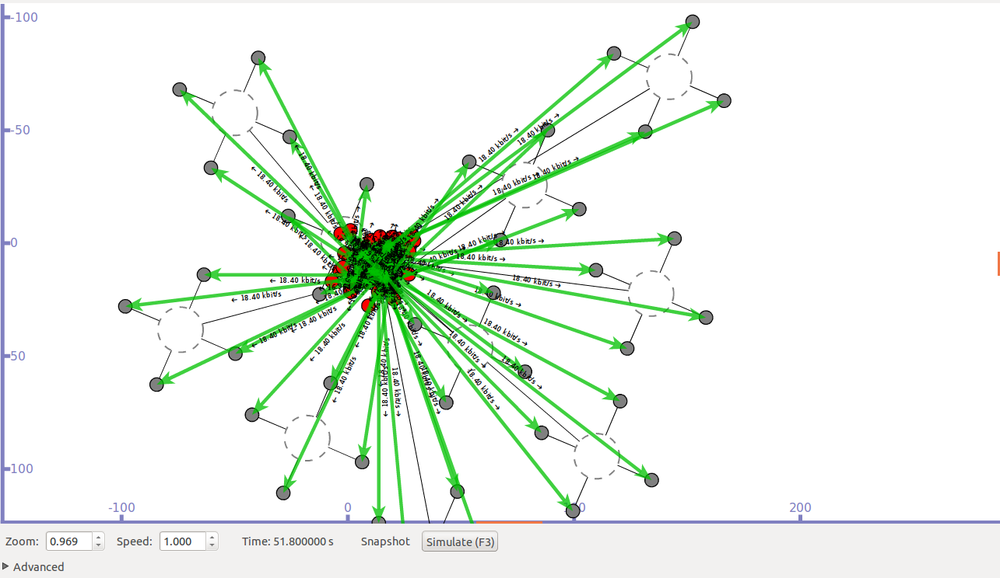
<figcaption>NS-3 simulation example .</figcaption>
</figure>

This simulator provides a robust platform for modelling communication
networks, including network protocols, devices, topologies, mobility
models, and propagation models. Its modular architecture allows
researchers to define and customise complex network scenarios, making it
possible to analyse protocol behaviour under diverse conditions without
the need for physical hardware [@ns3].

Its most salient features include:

- Support for both wired and wireless networks

- Detailed protocol-stack models (TCP/IP, Wi-Fi, LTE, 5G, etc.)

- Integration with external tools such as Wireshark and NetAnim

- Ability to simulate large-scale networks with high temporal precision

Thanks to its accuracy, flexibility, and active support community, NS-3
has become an essential tool in academia and research for studying
communication networks.

#### BonnMotion

BonnMotion is a Java-based software tool for generating and analysing
mobility scenarios. It is widely used in research on mobile ad-hoc
networks (MANETs), wireless sensor networks (WSNs), and vehicular ad-hoc
networks (VANETs). Its main function is to create movement traces that
can be exported to different network simulators, including **ns-2**,
**ns-3**, **GloMoSim/QualNet**, **COOJA**, **MiXiM**, and **The ONE**
[@bonnmotion].

BonnMotion produces mobility traces based on both synthetic and
scenario-specific models; version 3 adds the *Disaster Area Mobility
Model* (DA-MM)---illustrated in
**Figure [6.8](#fig:BonnMotion_scenario_diagram){reference-type="ref"
reference="fig:BonnMotion_scenario_diagram"}**---and exports directly to
`.ns2` and `.xml` formats compatible with `ns-3` [@Aschenbruck2010].
Notable profiles include *Random Street*, *Manhattan Grid*, and
*Disaster Area*, which incorporate obstacles, exclusion zones, and roles
(victim, rescuer, UAV). A study by Mahiddin *et al.* shows that using
DA-MM traces reduces PDR over-estimation by 18 % compared with *Random
Waypoint* in AODV tests [@Mahiddin2021].

<figure id="fig:BonnMotion_scenario_diagram" data-latex-placement="H">
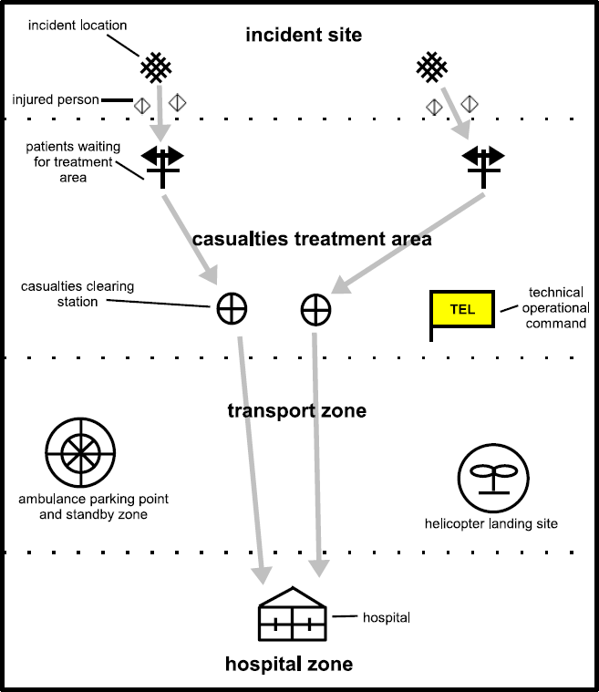
<figcaption>BonnMotion disaster scenario diagram .</figcaption>
</figure>

The tool was initially developed by the Communication Systems group at
the University of Bonn, Germany, and has since been maintained and
extended by other institutions such as Osnabrück University and the
Colorado School of Mines. BonnMotion supports a wide variety of mobility
models, including:

- **Random Waypoint**

- **Random Walk**

- **Gauss-Markov**

- **Manhattan Grid**

- **Reference Point Group Mobility (RPGM)**

- **Disaster Area**

- **Random Street**

- **Steady-State Random Waypoint**, entre otros[@bonnmotion].

Thanks to its flexibility and compatibility with multiple simulators,
BonnMotion has become an essential tool for researchers seeking to
evaluate network‐protocol behaviour under realistic mobility conditions.

##### Mobility--network synergy. {#mobilitynetwork-synergy. .unnumbered}

The typical workflow involves generating a trace with BonnMotion,
converting it to `ns-3` format using the `bm-converter` script, and
feeding it to `MobilityHelper`. This allows simulator nodes to reproduce
the exact trajectories while the upper layers record QoS degradation
whenever links are severed. Such synergy has been crucial for training
*deep RL* models that anticipate partitions and decide when to deploy
reinforcement UAVs [@Amponis2023]. Consequently, the `ns-3`+BonnMotion
pair has become the de facto standard for AI-based research in emergency
communications.

### Limitations of Simulated Environments

Although the `ns-3`+BonnMotion combination is the most widely used
testbed for *ad-hoc* networks, several factors can distort the
conclusions if they are not interpreted with caution. First, channel and
MAC models rely on statistical simplifications; phenomena such as
coherent multipath, co-channel interference, and hardware impairments
are only approximated, which can lead to discrepancies between simulated
values and field measurements [@Lai2022]. In addition, as the number of
nodes grows, computational load rises quickly and often forces
researchers to lower the temporal resolution or limit the generated
traffic, directly affecting delay and PDR.

Mobility and traffic fidelity are equally decisive: synthetic models or
CBR sources do not always capture the data spikes and human behaviour
typical of mass evacuations, resulting in overly optimistic QoS
estimates [@Mahiddin2021]. Moreover, porting the same scenario to other
simulators (e.g., Veins/OMNeT++) can yield divergent results because of
internal differences in timing and propagation, complicating cross-study
comparison [@Koc2020].

To mitigate these limitations, key parameters should be validated
against real measurements, multiple replicas with independent seeds
should be executed, and simulations should be complemented with
emulation or small field pilots whenever feasible. In this way, the
obtained results better approximate the network behaviour expected once
it is deployed in a real disaster scenario.

## Artificial Intelligence in Wireless Networks

**Artificial intelligence** (AI) encompasses techniques that allow
systems to learn from data, reason with models, and make autonomous
decisions [@Russell2021]. Within this umbrella, three main paradigms are
recognised: *supervised learning* (predicts outputs from labelled
inputs), *unsupervised learning* (discovers patterns without labels),
and *reinforcement learning* (optimises actions through rewards)
[@Chen2019]. These categories share a common workflow: data collection,
feature preparation and selection, model training, and validation.

In the field of **wireless networks**, AI operates across multiple
layers of the OSI stack:

- **Physical layer**: channel estimation and interference suppression
  via neural networks that replace traditional filters [@Qin2022].

- **MAC layer**: dynamic adjustment of contention windows, traffic
  prioritisation, and spectrum allocation in Wi-Fi or LTE schemes.

- **Network layer**: route selection, load balancing, and early
  congestion detection in both core and *ad-hoc* networks.

- **Management and orchestration**: power optimisation, *network
  slicing*, and self-organisation (SON) in 4G/5G infrastructures.

- **Security**: traffic classification, attack detection, and automatic
  anomaly response.

### Techniques: Supervised, Unsupervised, and Reinforcement Learning

AI algorithms applied to *ad-hoc* networks can be broadly classified
into three paradigms---*supervised*, *unsupervised*, and *reinforcement*
learning---each addressing a different class of problems within the
protocol stack.

##### Supervised learning. {#supervised-learning. .unnumbered}

This paradigm is employed when pairs
$\langle\text{input},\text{label}\rangle$ describing the network state
are available. Almeida *et al.* use a CNN to estimate *throughput* and
delay from `ns-3` traces, achieving an RMSE 35 % lower than that of
linear regressors [@Almeida2019]. Iqbal *et al.* train an *XGBoost*
ensemble on 120,000 MANET‐traffic samples and detect link failures with
an F1 score of 0.97, enabling early route reconfiguration [@Iqbal2023].
Such supervised solutions are well suited for **QoS prediction**,
**anomaly classification**, and **link‐state estimation**.

##### Unsupervised learning. {#unsupervised-learning. .unnumbered}

When labels are scarce, *clustering* and *dimensionality‐reduction*
methods uncover latent structure. Suh *et al.* apply *k-means* to
cluster nodes before training their DRL agent, reducing signalling
overhead by 30 % [@Suh2025]. Du *et al.* propose a **variational
autoencoder** that generates traffic embeddings and detects topological
anomalies, improving the detection rate by 12 % relative to PCA
[@Du2021]. Unsupervised learning is therefore useful for **forming
hierarchical clusters**, **inferring roles**, and **identifying
interference patterns** without prior knowledge.

##### Reinforcement learning (RL). {#reinforcement-learning-rl. .unnumbered}

RL is well suited to the dynamic, partially observable environments
typical of disasters. Protocols such as **DRLRR** use a DQN to select
the next route and raise PDR by 18 % in post-earthquake urban scenarios
[@Jin2024]. **PARRoT** combines trajectory information with RL, reducing
average latency in UAV swarms [@Sliwa2021]. More recent **multi-agent**
schemes---such as IDRL-VANET [@Upadhyay2023] and the proposal by Dikmen
*et al.* [@Dikmen2024]---coordinate routing and power decisions among
neighbouring nodes, preserving connectivity with only an 8 % throughput
penalty when scaling to 250 nodes.

Taken together, **supervised learning** delivers accurate predictions
when labelled data are available; **unsupervised learning** uncovers
hidden structure and segments the network to reduce complexity; and
**reinforcement learning** closes the control loop, adapting routes and
resources in real time. The combination of these paradigms---often in
hybrid architectures (e.g., GNN + RL or clustering + DQN)---represents
the current frontier in optimising *ad-hoc* networks for disaster
scenarios.

### Ethical and Practical Considerations

Applying AI to *ad-hoc* networks for disaster response offers
operational benefits but also raises moral and practical demands that
must be addressed before deployment.

##### Responsibility and safety. {#responsibility-and-safety. .unnumbered}

European guidelines for trustworthy AI state that systems must be robust
and include clear *accountability* mechanisms [@EC_HLEG2019]. When a
deep-RL agent makes routing decisions, any failure can paralyse
emergency communications; therefore, *circuit breakers* are recommended
to hand control back to proven protocols (AODV/OLSR) whenever the
intelligence behaves anomalously [@DOro2020].

##### Privacy and data protection. {#privacy-and-data-protection. .unnumbered}

Mass aggregation of geolocation traces---crucial for training mobility
models---poses re-identification risks. Anonymisation mechanisms based
on *differential privacy* reduce spatial filtering but raise
density-estimation error by up to 9 % [@Rahimi2021]. Techniques such as
federated learning or local differential privacy are advisable to
balance utility and confidentiality.

##### Fairness and bias. {#fairness-and-bias. .unnumbered}

Models trained on unbalanced data tend to prioritise high-density urban
areas, relegating rural communities; this creates QoS disparities in UAV
deployment or bandwidth allocation. Fairness audits show that an
unbalanced DRL algorithm delivered 15 % less PDR in peripheral zones
[@DOro2020]. Reward re-weighting or *oversampling* techniques can
mitigate this effect.

##### Transparency and explainability. {#transparency-and-explainability. .unnumbered}

Policies learned by DNNs are often opaque. *Explainable-AI* methods
(saliency maps, SHAP) reveal which metrics (link lifetime, local
density) drive the agent's actions and facilitate regulatory
certification [@Guidotti2022]. Mission-critical environments therefore
call for an interpretability threshold that enables human review.

##### Robustness against attacks. {#robustness-against-attacks. .unnumbered}

RL agents can be vulnerable to *poisoning* or adversarial jamming
attacks that alter rewards and deviate routes [@Lee2021adv]. Adversarial
training and GNN-based anomaly detection improve resilience, albeit with
added computational overhead.

##### Computational and energy cost. {#computational-and-energy-cost. .unnumbered}

On-line inference of large models can drain portable nodes. DOro
*et al.* show that a 1.2-M-parameter DQN agent increases power
consumption by 18 % on ARM Cortex-A53 nodes [@DOro2020]. Pruned networks
or hardware accelerators (e.g., NPUs) can lower this penalty without
sacrificing decision quality.

In summary, AI-based optimisation must be accompanied by ethical
safeguards---transparency, fairness, privacy---and by a practical
analysis of resources and threats. Only then will it be both acceptable
and sustainable for critical communications in disaster scenarios.

## Quality of Service and Performance Evaluation

### Metrics: Delay, Packet Delivery, and *Throughput*

Communication quality in *ad-hoc* networks is assessed primarily with
three key indicators:

##### (a) End-to-end delay ($D_{\text{e2e}}$). {#a-end-to-end-delay-d_texte2e. .unnumbered}

This is the average time elapsed between a packet's generation at the
sender and its correct reception at the destination:
$$D_{\text{e2e}}=\frac{1}{N_{\text{rx}}}\sum_{i=1}^{N_{\text{rx}}}\bigl(t^{\text{rx}}_i-t^{\text{tx}}_i\bigr),$$
where $N_{\text{rx}}$ is the number of packets received and
$t^{\text{tx}}_i$ and $t^{\text{rx}}_i$ are the transmission and
reception instants, respectively. Values of $D_{\text{e2e}}\le 150$ ms
are deemed acceptable for push-to-talk voice in rescue operations
[@ITU1540]. ns-3 studies show that congestion and hop count raise the
delay almost linearly ($R^{2}=0.92$) beyond the third retransmission
[@Petrov2022].

##### (b) Packet Delivery Ratio (PDR). {#b-packet-delivery-ratio-pdr. .unnumbered}

This metric measures data‐transport reliability:
$$\text{PDR}=\frac{N_{\text{rx}}}{N_{\text{tx}}}\times 100\text{\%},$$
where $N_{\text{tx}}$ is the total number of packets sent. Recent DRL
protocols maintain PDR $\ge 90\%$ up to densities of 150 nodes, whereas
AODV drops below 80 % in the same scenario [@Jin2024]. The ITU
recommends PDR $\ge 95\%$ for critical‐telemetry applications
[@ITU1540].

##### (c) *Throughput* ($\mathcal{T}$). {#c-throughput-mathcalt. .unnumbered}

Amount of useful bits received per unit time:
$$\mathcal{T}= \frac{\sum_{i=1}^{N_{\text{rx}}} L_i}{T_{\text{sim}}}\quad [\text{bit/s}],$$
where $L_i$ is the length (bits) of packet $i$ and $T_{\text{sim}}$ is
the simulation duration. Razouqi *et al.* report that *throughput* drops
by 37 % when the `HELLO` interval is shortened from 1 s to 0.25 s
because of higher control overhead [@Razouqi2024]. Streaming 720p video
at 30 fps requires at least 2 Mb/s per flow---a crucial reference when
sizing inspection FANETs [@Shen2024].

##### Complementary metrics. {#complementary-metrics. .unnumbered}

*Jitter* (delay variation), *goodput* (useful bits over total bits), and
energy consumed per delivered bit are increasingly used in AI
evaluations, as they capture the temporal stability and efficiency of a
protocol [@Molnar2021]. In disaster networks, normalising these
indicators facilitates cross-study comparison and helps identify
configurations that prioritise quality of service over raw throughput.

### Network Evaluation in Simulated Scenarios

The credibility of experiments carried out with `ns-3`+BonnMotion hinges
on an **evaluation methodology** that covers statistical design,
scenario diversity, and sensitivity analysis.

##### 1. Statistical design and replicas. {#statistical-design-and-replicas. .unnumbered}

The `ns-3` statistics framework recommends running at least 10 replicas
with independent seeds and reporting *95 % confidence intervals (CIs)*
[@ns3stats]. Petrov *et al.* confirm that a sample size of $n\ge 10$
keeps CI error below 5 % for PDR and delay [@Petrov2022]. Pullen and
Buchner warn that increasing the integration step to speed up large
simulations (\>$500$ nodes) can underestimate delay by around 20 %,
reinforcing the need to balance accuracy and computational cost
[@Pullen2017].

##### 2. Parameter and scenario coverage. {#parameter-and-scenario-coverage. .unnumbered}

To avoid biased conclusions, a *factorial design* is recommended,
combining:

- **Node density**: low (50), medium (150), high (300).

- **Mobility patterns**: DA-MM with mild/medium/severe intensities
  [@Affandi2024].

- **Traffic load**: CBR 64 kb/s, push-to-talk voice 16 kb/s, video
  2 Mb/s.

- **Channel models**: `Nakagami(`$m=1$`)`, `LogDistance`,
  `ObstacleShadowing` [@Carpenter2015].

Razouqi *et al.* show that conclusions changed from "AODV superior" to
"OLSR superior" when density increased from 100 to 200 nodes---even
though the metrics and simulator were identical [@Razouqi2024]. Hence,
exhaustive parameter exploration is essential.

##### 3. Sensitivity analysis and external validity. {#sensitivity-analysis-and-external-validity. .unnumbered}

Lai *et al.* propose varying each parameter by $\pm 10\%$ and measuring
the elasticity of the metrics; they identify transmit power and the
`HELLO` interval as explaining 70 % of the variance in PDR [@Lai2022].
Moreover, comparing simulation results with *field benchmarks* or DCE
emulation reduces the simulator--reality gap [@Riley2010].

### Impact of Mobility and Environment on QoS

Quality of service (QoS) in *ad-hoc* networks varies markedly with
**speed**, **node density**, and the environment's **physical
characteristics**. The most relevant findings are summarised below.

##### Speed and movement pattern. {#speed-and-movement-pattern. .unnumbered}

Increasing the average speed from 2 m/s to 15 m/s causes a near-linear
drop in *Packet Delivery Ratio* (PDR) from 95 % to 74 % in AODV, owing
to more frequent link breaks [@Petrov2022]. Kumar *et al.* observed that
a smoothed 3-D Gauss--Markov model raises PDR by 7 % over the classical
Gauss--Markov model by mitigating abrupt direction changes in UAV swarms
[@Kumar2023]. These results underscore the importance of realistic
mobility models (DA-MM, ASSGM-3D) to avoid overestimating QoS.

##### Density and congestion. {#density-and-congestion. .unnumbered}

Razouqi *et al.* demonstrated that as node density increases from 50 to
300, end-to-end latency grows almost quadratically---from 38 ms to 235
ms---owing to control-channel saturation [@Razouqi2024]. Unsupervised
clustering strategies, such as the one proposed by Suh *et al.*, cut
overhead by 30 % and stabilise latency at 180 ms even in dense
topologies [@Suh2025].

##### Physical environment and obstacles. {#physical-environment-and-obstacles. .unnumbered}

Carpenter and Sichitiu's `ObstacleShadowing` model shows that concrete
buildings add 14--22 dB of attenuation, reducing *throughput* by 35 % in
urban scenarios relative to free space [@Carpenter2015]. Lai *et al.*
found that the combination of high mobility and shadow zones explains 70
% of the variance in PDR, underscoring the need for joint
mobility--channel co-simulation [@Lai2022].

##### Weather and environmental conditions. {#weather-and-environmental-conditions. .unnumbered}

Ribeiro *et al.* evaluated fire‐response networks and found that dense
smoke propagation increases packet-loss rates by up to 12 %,
highlighting the need for real-time power adjustment and channel
selection [@Ribeiro2023]. In coastal settings, marine reflectance can
improve low-altitude coverage, raising PDR by about 5 % in
maritime-rescue FANETs [@Lakew2020].

Studies show that *QoS is tightly coupled* to mobility dynamics and the
physical environment. Simulation campaigns should therefore:

1.  Use realistic mobility models and cover a range of speeds and
    densities,

2.  Include obstacle losses and climatic variability, and

3.  Apply AI techniques (clustering, DRL) that adapt to such changes.

Only under these conditions will delay, PDR, and throughput metrics
reflect the performance expected when the network is deployed in a
genuine disaster scenario.

# Methodology {#chap:methods}

Figure [7.1](#fig:methodology_flow){reference-type="ref"
reference="fig:methodology_flow"} illustrates the overall workflow for
implementing artificial intelligence in disaster scenarios. To simulate
human mobility in post-disaster environments, we used the **BonnMotion**
simulator, which generates realistic movement patterns of individuals in
dynamic and chaotic conditions. For modeling communication between
individuals, we employed the **ns-3** network simulator, configuring it
to represent ad hoc wireless networks in infrastructure-less settings.
During the simulation process, we collected relevant communication
parameters, including the *channel utilization factor* and the *queue
packet size*, which serve as the primary input features for our AI
model.

In the data processing phase, the collected information was labeled to
construct a supervised learning dataset. We trained a machine learning
model using this dataset, incorporating *hyperparameter optimization
techniques* to improve model performance. The trained model was then
evaluated using standard machine learning metrics. Finally, the
resulting model was exported and integrated back into the **ns-3**
simulation environment, allowing us to test its performance under new
disaster-driven communication scenarios. Additional details about each
component of the methodology are presented in the following subsections.

<figure id="fig:methodology_flow" data-latex-placement="ht">
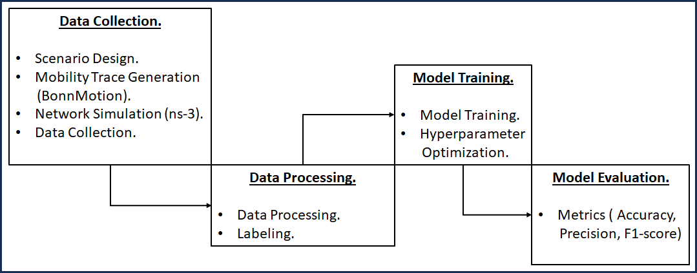
<figcaption>Overview of the proposed methodology for integrating AI into
disaster scenarios.</figcaption>
</figure>

## Typical Disaster-Area Scenario

The **Disaster Area Mobility Model** (DA-MM)---included in
BonnMotion 3---was designed to *accurately reproduce* the movements of
victims and first responders after a catastrophic event
[@Aschenbruck2010]. Unlike random-waypoint models, DA-MM partitions the
scene into *functional zones*: debris fields, command posts, evacuation
routes, and safe areas. Each zone enforces specific speed limits,
turning angles, and congestion probabilities, so that node trajectories
capture both physical obstacles and the tactical logic of
search-and-rescue operations.

##### Key parameters. {#key-parameters. .unnumbered}

- `-n` : number of nodes per role (*victim*, *rescuer*, *uav*).

- `-d` : simulation duration (s).

- `-x` /`-y` : dimensions of the disaster zone (m).

- `-vR` and `-vV` : speed distributions for rescuers and victims,
  respectively.

- `-obst` : polygons that represent collapsed buildings or blocked
  streets.

The scenario depicted in
**Figure [7.2](#fig:Disaster_area_scenario_introductory){reference-type="ref"
reference="fig:Disaster_area_scenario_introductory"}** is presented as
an introductory example and is based on a large-scale disaster drill.
The exercise took place in May 2005 in Cologne, Germany, as part of the
preparations for World Youth Day 2005 and the FIFA World Cup 2006. The
underlying assumption was that a catastrophe in an event hall had
injured more than 250 people [@ASCHENBRUCK2009773].

<figure id="fig:Disaster_area_scenario_introductory"
data-latex-placement="ht">
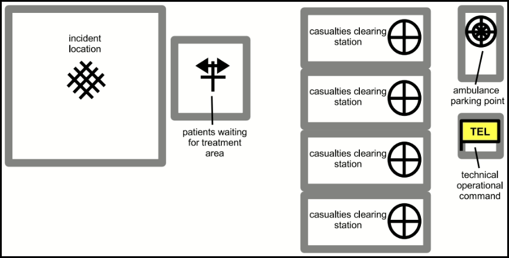
<figcaption>Introductory disaster area scenario .</figcaption>
</figure>

The different zones involved in this scenario are listed in
**Table [7.1](#tab:Name_of_areas){reference-type="ref"
reference="tab:Name_of_areas"}**. The overall area spans approximately
$350 \times 200$ m. The incident location is the event hall; directly in
front of it lies the zone where patients wait for treatment. Injured
individuals are transported to four casualty-clearing stations. In
addition, a technical operational command centre and an ambulance
parking point are provided.

::: {#tab:Name_of_areas}
  **Acronym.**   **Area**
  -------------- -------------------------------------
  IL             Incident location
  PWFTA          Patients waiting for treatment area
  CCS            Casualties clearing stations
  APP            Ambulance parking point
  TEL            Technical operational command

  : Areas in disaster scenario.
:::

## Parameters and configuration of the disaster scenario in BonnMotion.

**Figure [7.3](#fig:Proposed_disaster_scenario){reference-type="ref"
reference="fig:Proposed_disaster_scenario"}** depicts a
$350 \times 200\text{\,m}$ disaster scenario inspired by the drills
conducted in Cologne (2005) for World Youth Day 2005 and the 2006 FIFA
World Cup. The tactical zones---*Incident Location* (IL), *Patients
Waiting For Treatment Area* (PWFTA), *Casualties Clearing Station*
(CCS), *Ambulance Parking Point* (APP), and the centralised *Technical
Operational Command* (TEL)---mirror the real flow of casualties and
resources during the first hours after the event, as summarised in
[7.1](#tab:Name_of_areas){reference-type="ref+label"
reference="tab:Name_of_areas"}. This layout enables differentiated
mobility patterns: chaotic movements in IL, ambulance routes between CCS
and APP, and coordination traffic concentrated at TEL.

<figure id="fig:Proposed_disaster_scenario" data-latex-placement="ht">
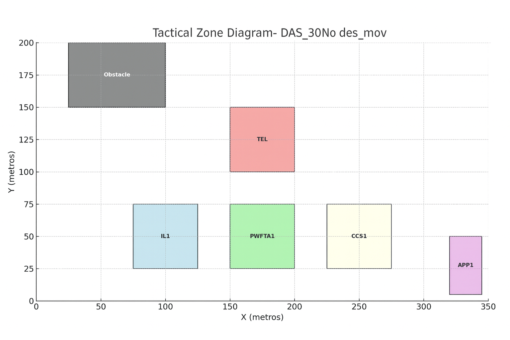
<figcaption>Proposed disaster scenario.</figcaption>
</figure>

In this study, the grey rectangle labelled *Obstacle* is retained solely
as a spatial landmark and does not affect the propagation layer.
Explicitly modelling diffraction and obstacle-specific shadowing would
add computational complexity without providing decisive information for
the QoS analysis; therefore, the evaluation focuses on the spatial
dynamics of the nodes and the traffic load under realistic mobility
conditions.

##### Trajectories within the disaster scenario. {#trajectories-within-the-disaster-scenario. .unnumbered}

Figure [7.4](#fig:Movimiento_aleatorio_de_los_nodos){reference-type="ref"
reference="fig:Movimiento_aleatorio_de_los_nodos"} displays the
trajectories generated by BonnMotion for the 30 nodes in the
*DisasterArea* scenario. Each coloured rectangle represents a specific
tactical zone---*Incident Location* (IL, blue), *Patients Waiting For
Treatment Area* (PWFTA, green), *Casualties Clearing Station* (CCS,
beige), *Ambulance Parking Point* (APP, purple), and the *Technical
Operational Command* (TEL, red)---while the grey arrows indicate the
nodes' random movements over the 300 s simulation.

<figure id="fig:Movimiento_aleatorio_de_los_nodos"
data-latex-placement="ht">
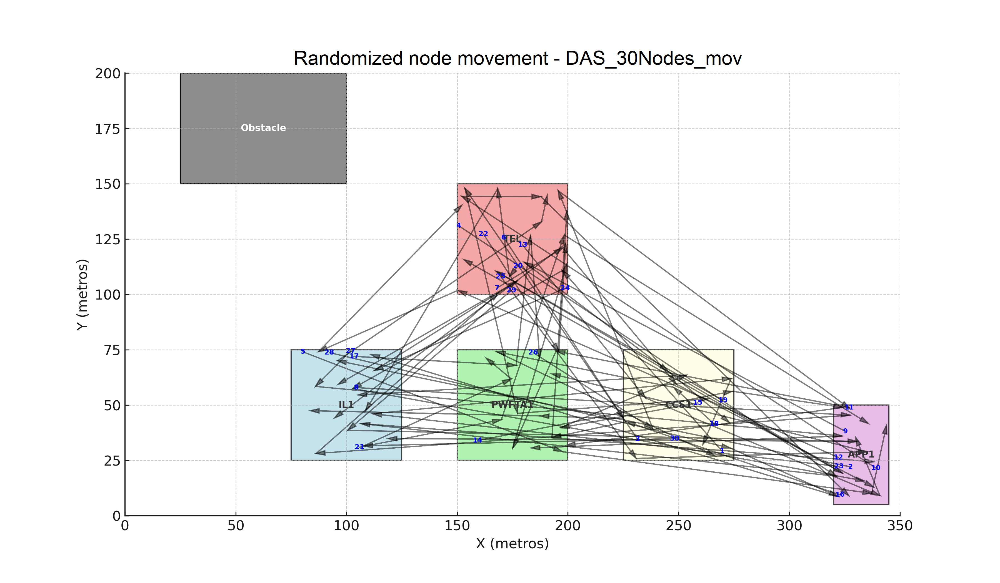
<figcaption>Random movement of the nodes.</figcaption>
</figure>

- **Intra-zone dynamics.** Within each area, the nodes follow a uniform
  random pattern, mirroring the chaotic mobility of victims and rescuers
  who move without a predefined route yet remain confined to their
  operational perimeter.

- **Inter-zone flows.** The lines connecting different zones emulate
  real transfers: from IL to PWFTA and CCS (evacuation of casualties),
  from CCS to APP (ambulance boarding), and from all zones to TEL (data
  uploads and resource requests). These transitions are crucial for
  triggering link breaks and assessing the resilience of routing
  protocols.

- **Spatio-temporal variability.** The overlay of trajectories reveals
  changing densities---local congestion at the TEL (command centre)
  versus dispersion at the APP (peripheral area). Such variability
  forces network algorithms to adapt to both dense clusters and long,
  low-connectivity links.

- **Obstacle.** The grey rectangle labelled "Obstacle" is kept as a
  geographic landmark ---representing debris or a collapsed wall--- but
  is not enabled in the propagation model, so the analysis focuses on
  pure mobility effects at the network layer.

Taken together, this controlled random pattern reproduces the inherent
unpredictability of a disaster and yields a highly dynamic topology:
short-lived links within zones and longer (up to 200 m) inter-area
connections. Such dynamism is indispensable for testing
*Machine-Learning* algorithms capable of anticipating partitions,
adjusting power, or re-routing critical traffic in real time.

##### Parameter configuration. {#parameter-configuration. .unnumbered}

As shown in [7.2](#tab:global_params){reference-type="ref+label"
reference="tab:global_params"}, the "DisasterArea" scenario is
configured for 30 nodes in a $350 \times 200\text{\,m}$ area and a
duration of five minutes, representing the critical initial phase of a
mass-casualty incident. Group changes are disabled (`$groupchange = 0`)
to reflect the autonomy of each terminal, and the random seed is fixed
(`$seed = 23`) to ensure experimental reproducibility. These settings
balance operational realism and computational cost, providing a solid
foundation for assessing routing protocols and AI algorithms under
mobility conditions that closely resemble reality.

::: {#tab:global_params}
  **Variable**        **Value**        **Description**
  ------------------- ---------------- -------------------------------------------------------
  `$model`            `DisasterArea`   Mobility model chosen in BonnMotion.
  `$scenario`         `DAS_30Nodes`    Trace prefix for version control and tracking.
  `$nodes`            30               Number of nodes: operational staff plus sensors.
  `$x`                350              Length of the area (m), taken from the Cologne drill.
  `$y`                200              Width of the area (m).
  `$groupchange`      0                No group change: nodes act autonomously.
  `$groupsize`        1                Each node forms its own group (individual).
  `$dist`             3 m              Minimum intra-group distance to avoid overlaps.
  `$mindist`          3 m              Absolute minimum distance between any pair of nodes.
  `$circlevertices`   140              Polygon resolution for circular areas.
  `$factor`           1                Speed-scale factor (no modification).
  `$duration`         300 s            Simulation window (first 5 min of the emergency).
  `$skip`             1 s              Temporal sampling step in the trace.
  `$seed`             23               Random seed for reproducibility.
  `$maxpause`         0 s              Maximum pause: nodes always in active movement.

  : Global parameters used to generate the mobility trace in BonnMotion.
:::

Figure [7.5](#fig:DisasterAreaConfiguration1){reference-type="ref"
reference="fig:DisasterAreaConfiguration1"} presents the mobility-trace
parameters as configured in BonnMotion.

<figure id="fig:DisasterAreaConfiguration1" data-latex-placement="ht">
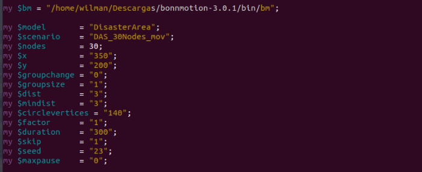
<figcaption>Parameters used to generate the mobility trace in
BonnMotion.</figcaption>
</figure>

[7.3](#tab:tactical_areas){reference-type="ref+label"
reference="tab:tactical_areas"} lists the rectangular boundaries (in
metres) and the operational purpose of each tactical block within the
*DisasterArea* model. The IL, PWFTA, and CCS areas are aligned along the
$x$-axis to reflect the horizontal evacuation flow from the incident
site to the casualty-clearing station, whereas the TEL is placed in a
central, elevated location, maximising its betweenness in the
communication mesh. The APP is positioned at the far eastern edge to
enforce long outbound links. This spatial arrangement allows
differentiated mobility patterns and traffic loads to be assigned,
thereby increasing the realism of the simulations relative to the actual
flows in a rescue operation.

::: {#tab:tactical_areas}
  **Acronym**   **X Range**   **Y Range**   **Operational Role**
  ------------- ------------- ------------- ----------------------------------------------
  IL1           75--125       25--75        Incident Location (epicentre of the event)
  PWFTA1        150--200      25--75        Patients Waiting for Treatment Area (triage)
  CCS1          225--275      25--75        Casualties Clearing Station (stabilisation)
  TEL           150--200      100--150      TechnicalOperationalCommand (command centre)
  APP1          320--345      5--50         Ambulance Parking Point (victim loading)
  OBST1         25--100       150--200      Obstacle (debris / collapsed wall)

  : Coordinates and operational functions of the tactical zones in the
  scenario.
:::

Figure [7.6](#fig:DisasterAreaConfiguration2){reference-type="ref"
reference="fig:DisasterAreaConfiguration2"} shows the coordinates and
operational roles of the tactical zones in the scenario as configured in
BonnMotion.

<figure id="fig:DisasterAreaConfiguration2" data-latex-placement="ht">
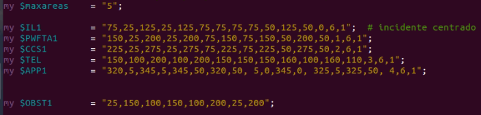
<figcaption>Coordinates of the tactical zones in the
scenario.</figcaption>
</figure>

##### Command-line construction and execution. {#command-line-construction-and-execution. .unnumbered}

[7.7](#fig:bm_params_exec){reference-type="ref+label"
reference="fig:bm_params_exec"} illustrates how all the required flags
are concatenated into the `$params` variable so that BonnMotion can
generate the `DAS_30Nodes` trace with the *DisasterArea* model. The
workflow follows the classical *configure* $\rightarrow$ *build*
$\rightarrow$ *run* pattern:

- `-f $scenario DisasterArea` simultaneously sets the output file
  *prefix* and selects the *mobility model*.

- `-n $nodes -x $x -y $y` instantiates 30 nodes within a
  $350 \times 200$ m rectangle.

- `-p $maxpause` sets the maximum pause to 0 s, ensuring continuous
  movement.

- `-g $groupsize -g $circlevertices -r $dist -q $mindist` defines group
  micro- dynamics and the minimum inter-node distance.

- `-d $duration -e $naxareas -l $skip -j $factor` control the simulation
  length (300 s), the number of tactical areas (5), and the temporal
  resolution (1 s).

- The five occurrences of `-b ...` describe the rectangles IL, PWFTA,
  CCS, TEL, and APP, while `-o $OBST1` adds a reference obstacle.

- The flag `-K` instructs BonnMotion to produce a `.stat` file with
  global statistics.

- Finally, `-R $seed` fixes the random seed (23), ensuring
  reproducibility.

The call `system("$bm $params");` executes the `bm` binary with the full
command string, producing three essential outputs: `DAS_30Nodes_mov.mov`
(a position trace with 1 s granularity), `DAS_30Nodes_mov.ns2` / `.xml`
(directly importable into `ns-3`), and `DAS_30Nod es_mov.stat`
(aggregate metrics). This procedure---explicit parameterisation combined
with automatic command construction---ensures that the experiments can
be reproduced on any Linux environment running BonnMotion 3, thereby
promoting transparency and facilitating direct comparison with related
work.

<figure id="fig:bm_params_exec" data-latex-placement="ht">
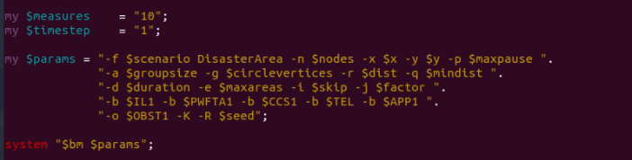
<figcaption>Execution parameters used in the BonnMotion
command.</figcaption>
</figure>

## Data Collection

In the data collection phase, we used the **BonnMotion** tool to
simulate the mobility of individuals in a disaster scenario. This tool
allows the generation of realistic human movement patterns, which are
essential to model behavior in chaotic environments. The main parameters
configured in BonnMotion for this study are summarized in
Table [7.4](#tab:bonnmotion_params){reference-type="ref"
reference="tab:bonnmotion_params"}.

To simulate communication between individuals, we used the **ns-3**
simulator, configuring a wireless ad hoc network without fixed
infrastructure. The network layer employed the **OLSR** (Optimized Link
State Routing) protocol, which is suitable for highly dynamic topologies
typical in disaster situations. At the transport layer, the **UDP**
protocol was used. Packet sizes followed an **exponential distribution**
with an average of approximately 200 bytes, reflecting the variability
in message lengths common in emergency communications. Additionally, we
used the **IEEE 802.11a** standard to model the physical layer of the
wireless network. The main simulation parameters configured in ns-3 are
shown in Table [7.5](#tab:ns3_params){reference-type="ref"
reference="tab:ns3_params"}.

To improve the diversity and robustness of the dataset, multiple
simulation runs were performed with different random seeds. This
approach enabled the collection of a wide range of communication
scenarios and mobility patterns. The simulation outputs were stored and
organized to compute key performance metrics, including *channel
utilization* and *queue packet size*, which serve as input features for
the machine learning model.

::: {#tab:bonnmotion_params}
  **Parameter**         **Value / Description**
  --------------------- -----------------------------
  Mobility Model        \[Disaster Mobility Model\]
  Number of Nodes       \[30\]
  Simulation Duration   \[300 seconds\]
  Area Dimensions       \[350 m $\times$ 200 m\]
  Speed Range           \[0.5 to 1.5 m/s\]
  Pause Time            \[0 s\]

  : Key Parameters Used in BonnMotion Simulation
:::

::: {#tab:ns3_params}
  **Parameter**              **Value / Description**
  -------------------------- -------------------------------------
  Network Protocol           OLSR (Optimized Link State Routing)
  Transport Protocol         UDP
  Packet Size Distribution   Exponential (mean: 200 bytes)
  PHY/MAC Standard           IEEE 802.11a
  Channel Bandwidth          \[20 MHz\]
  Simulation Time            \[300 seconds\]
  Number of Nodes            \[30\]
  Seed Variations            Multiple seeds for robustness
  Application Traffic        \[Variable bit rate\]
  Queue Type                 \[FIFO\]

  : NS-3 Simulation Configuration Parameters
:::

## Data Processing

After the simulation phase, a large volume of raw data was collected
from multiple network runs. These data represent low-level information
related to node behavior, packet transmissions, queue dynamics, and
channel access events. To prepare the dataset for machine learning, it
was necessary to apply specific feature extraction techniques to derive
meaningful indicators of network status.

For our study, we focused on two key features that characterize the
state of the network at any given time:

- **Channel Utilization Factor** : This metric estimates the level of
  congestion in the wireless medium. It is calculated by monitoring the
  percentage of time the channel is sensed as busy versus idle. To
  smooth temporal fluctuations and capture recent behavior trends, we
  applied an *Exponential Weighted Moving Average (EWMA)* over the raw
  channel activity measurements.

- **Queue Packet Count** : This metric reflects the number of packets
  queued for transmission at each node. A high queue occupancy may
  indicate potential congestion, which could lead to packet drops or
  increased delays. The queue management policy used was the default
  *FIFO* (First-In-First-Out) policy provided by the **ns-3** simulator.

These two features were extracted at regular time intervals throughout
each simulation and paired with the corresponding network outcomes. In
particular, each data instance was labeled according to whether a packet
successfully reached its destination or not, under the prevailing
network conditions. This labeled dataset forms the basis for training
our machine learning model, enabling it to learn how network metrics
influence packet delivery success in disaster-driven ad hoc
environments.

## Model Training

The classification task in this study is binary in nature: given the
current network conditions, the model must predict whether a packet will
be successfully delivered to its destination or not. Various supervised
learning algorithms could be applied to this type of problem; however,
we chose to employ an ensemble-based approach using the **CatBoost**
classifier.

**CatBoost**, developed by Yandex, is a high-performance gradient
boosting algorithm based on decision trees. It is specifically designed
to handle categorical data efficiently and reduce overfitting by
implementing advanced techniques such as ordered boosting. One of its
main advantages lies in its efficient handling of decision splits
through symmetric trees and histogram-based processing, which makes it
especially suitable for deployment on resource-constrained devices.

To train the CatBoost model, we focused on tuning the most critical
hyperparameters: the **tree depth**, set to values between 6 and 10, and
the **number of trees**, which varied up to 5000 estimators. In order to
determine the optimal combination of these hyperparameters, we performed
an exhaustive **Grid Search**. This method was selected over more
lightweight alternatives due to the availability of sufficient
computational resources, allowing for a comprehensive evaluation of the
hyperparameter space.

The final trained model was validated using a hold-out portion of the
dataset and evaluated using standard classification metrics, as
discussed in the next section.

## Model Evaluation

The performance of the trained CatBoost model was evaluated using
standard machine learning metrics for binary classification, including
**accuracy**, **precision**, and the **F1-score**. These metrics provide
a comprehensive view of the model's ability to distinguish between
successful and unsuccessful packet deliveries under varying network
conditions.

*Accuracy* measures the proportion of correct predictions out of all
predictions made, offering a general indication of overall model
performance. *Precision* quantifies the ratio of true positive
predictions to all positive predictions made, reflecting the model's
reliability when it predicts that a packet will be successfully
delivered. The *F1-score* is the harmonic mean of precision and recall,
providing a balanced assessment that is especially useful in the
presence of class imbalance. These metrics were computed on a held-out
test set, allowing for an unbiased evaluation of the model's
generalization capabilities. The results obtained indicate that the
model achieves high predictive performance, making it suitable for
real-time deployment in simulated disaster communication environments.

# Results and Discussion {#chap:results}

## Numerical Results

After training the artificial intelligence model using the custom-built
dataset and validating its performance through machine learning metrics,
the final model was exported and integrated into the **ns-3** simulator.
The aim was to evaluate its effectiveness in a simulated disaster
scenario by comparing network performance in two different settings: one
without Quality of Service (QoS) mechanisms and another enhanced with
the AI-driven decision-making process.

To quantify the benefits of the proposed approach, we evaluated both
scenarios using key network performance indicators. These include the
**Packet Delivery Ratio (PDR)**, which represents the percentage of
packets successfully delivered to their destinations; the
**Throughput**, which measures the effective data rate achieved by the
network; and the **End-to-End Delay**, which quantifies the average time
taken for packets to traverse the network from source to destination.

The detailed analysis and comparison of these metrics are presented in
the following subsections.

## Packet Delivery Ratio (PDR)

Figure [8.1](#fig:pdr_results){reference-type="ref"
reference="fig:pdr_results"} presents the evaluation of the Packet
Delivery Ratio (PDR) across four applications in a disaster scenario.
Human mobility patterns were generated using the BonnMotion simulator,
and wireless ad hoc communication was modeled using ns-3. The experiment
compares three QoS strategies: a baseline scenario without congestion
control (NO_CC), a traditional approach using EDCA (EDCA_CC), and an
AI-driven method (ML_CC) based on a CatBoost model trained on relevant
network features.

As depicted in the figure, the AI-based solution (ML_CC) consistently
outperforms the other two approaches in terms of PDR. While the EDCA
mechanism provides moderate improvements over the NO_CC scenario in
certain applications, its performance degrades significantly under
specific conditions, particularly in App 4. In contrast, the ML_CC
approach demonstrates robustness and adaptability by maintaining high
PDR across all applications.

These results suggest that the AI-enhanced strategy is better equipped
to handle the dynamic and congested conditions typical of disaster
environments. By leveraging real-time features such as channel occupancy
and queue length, the model is able to make informed decisions about
packet transmission, thereby improving reliability and overall QoS
performance.

<figure id="fig:pdr_results" data-latex-placement="ht">
<embed src="./images/pdr.pdf" style="width:80.0%" />
<figcaption>Comparison of Packet Delivery Ratio (PDR) under three QoS
scenarios in a disaster environment: no congestion control (NO_CC),
EDCA-based control (EDCA_CC), and machine learning-based control
(ML_CC).</figcaption>
</figure>

## Throughput

Throughput, defined as the rate of successfully received data at the
destination (in kbps), is a critical metric for assessing the efficiency
of communication in disaster-prone ad hoc networks. These environments
are highly dynamic, with frequent topology changes, variable signal
conditions, and intense channel contention---making high throughput
difficult to sustain.

Figure [8.2](#fig:throughput_results){reference-type="ref"
reference="fig:throughput_results"} illustrates the throughput
performance of the three QoS strategies evaluated: the baseline without
congestion control (**NO_CC**), the EDCA-based mechanism (**EDCA_CC**),
and the machine learning-based control (**ML_CC**) using the
**CatBoost** algorithm.

Overall, the **ML_CC** approach achieves comparable or higher throughput
than the other scenarios, particularly in applications where traditional
methods struggle. For example, in **App 4**, **ML_CC** significantly
outperforms both **EDCA_CC** and **NO_CC**, highlighting its ability to
adapt under high congestion or degraded channel conditions. While
**EDCA_CC** shows slight improvements over the baseline in some
applications (Apps 1 and 2), it suffers in others due to its static
nature and lack of predictive capabilities.

These findings reinforce the value of intelligent, data-driven control
mechanisms that can dynamically adjust to real-time network states. The
increased throughput seen with **ML_CC** aligns with the improvements
observed in **Packet Delivery Ratio (PDR)**, and further demonstrates
the effectiveness of machine learning in reducing retransmissions,
optimizing packet scheduling, and improving overall communication
efficiency in critical scenarios.

<figure id="fig:throughput_results" data-latex-placement="ht">
<embed src="./images/throughput.pdf" style="width:80.0%" />
<figcaption>Comparison of received throughput across three QoS
strategies (<strong>NO_CC</strong>, <strong>EDCA_CC</strong>, and
<strong>ML_CC</strong>) in a simulated disaster scenario.</figcaption>
</figure>

## End-to-End Delay

End-to-End Delay refers to the average time a data packet takes to
travel from the source to the destination node. This metric encompasses
all types of delays, including those caused by buffering,
retransmissions, routing decisions, and medium access contention. In
highly dynamic and unpredictable disaster scenarios, reducing delay is
essential for enabling prompt communication, especially in applications
that involve safety-critical or emergency data.

Figure [8.3](#fig:delay_results){reference-type="ref"
reference="fig:delay_results"} displays the end-to-end delay observed
under three different Quality of Service (QoS) strategies: no congestion
control (**NO_CC**), EDCA-based control (**EDCA_CC**), and machine
learning-based control (**ML_CC**) using the **CatBoost** algorithm.

The results show a significant reduction in delay for the **ML_CC**
scenario across all applications. While the EDCA approach achieves
moderate improvements over the baseline, it fails to maintain low delay
under more congested or variable conditions (e.g., **App 4**). In
contrast, the **ML_CC** strategy exhibits consistent low latency,
indicating its effectiveness in avoiding transmission under unfavorable
conditions such as high queue occupancy or busy channels.

These findings demonstrate that AI-driven strategies can dynamically
adapt to the network state, minimize queuing and processing delays, and
ultimately enhance responsiveness in wireless ad hoc environments
affected by disaster-induced mobility and interference.

<figure id="fig:delay_results" data-latex-placement="ht">
<embed src="./images/end_to_end_delay.pdf" style="width:80.0%" />
<figcaption>Comparison of end-to-end delay under three QoS strategies
(<strong>NO_CC</strong>, <strong>EDCA_CC</strong>, and
<strong>ML_CC</strong>) in a disaster scenario.</figcaption>
</figure>

# Conclusions {#chap:conclusions}

- This work presented an intelligent approach for improving
  communication in ad hoc wireless networks deployed in disaster
  scenarios. By simulating realistic mobility patterns using
  **BonnMotion** and modeling infrastructure-less communication through
  **ns-3**, we constructed a custom dataset from scratch. This dataset
  captured key performance indicators of the network, particularly the
  *channel utilization factor* and *queue packet size*, which were used
  to train a **CatBoost**-based machine learning model for binary
  classification.

- The trained model was validated using machine learning metrics such as
  accuracy, precision, and F1-score, and subsequently exported back into
  the simulation environment to support real-time decision-making.
  Comparative experiments showed that the AI-enhanced communication
  strategy significantly outperforms the baseline (without QoS) in terms
  of **Packet Delivery Ratio (PDR)**, **Throughput**, and **End-to-End
  Delay**.

- These results demonstrate the potential of integrating AI into network
  protocol layers for enabling adaptive, context-aware communication
  strategies in highly dynamic environments. As future work, we plan to
  extend our model to support multi-class decision-making, incorporate
  additional features such as link stability or energy consumption, and
  evaluate real-time implementations on embedded or low-cost hardware
  platforms.
