# Diagramas Conceptuales para la Tesis

Estos diagramas se pueden convertir a imagenes usando: - **Mermaid Live Editor**: https://mermaid.live/ - **VS Code extension**: Mermaid Preview - **Overleaf**: Con paquete `mermaid` o exportando desde mermaid.live

------------------------------------------------------------------------

## 1. Ventana Temporal de Entrada (6 meses × 21 features)

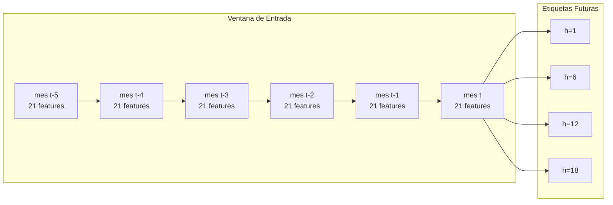

------------------------------------------------------------------------

## 2. Division de Datos (Train / Validation / Test)

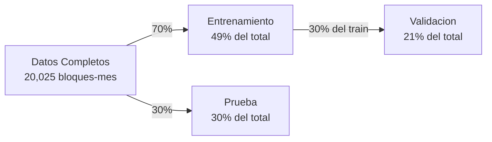

### Diagrama de Linea de Tiempo

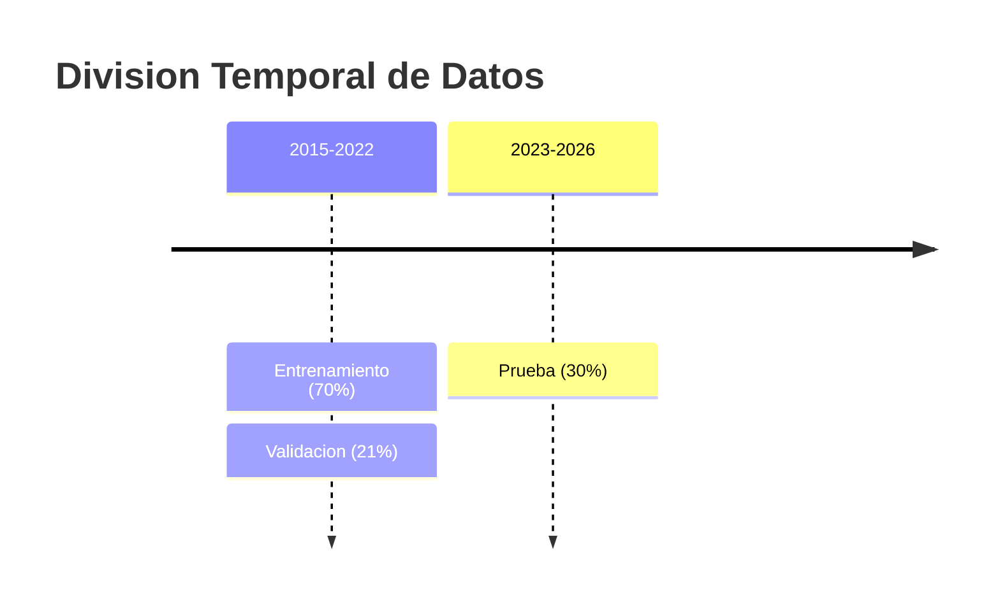

------------------------------------------------------------------------

## 3. Comparacion de Arquitecturas de Modelos

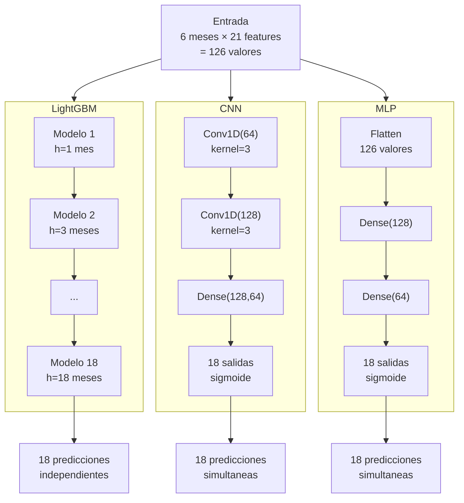

------------------------------------------------------------------------

## 4. Arquitectura del Sistema Completo

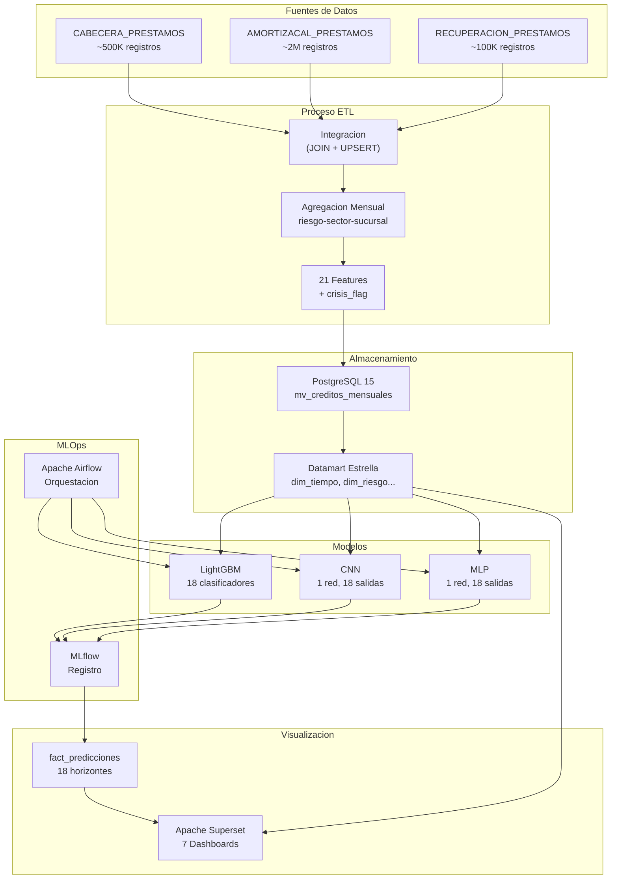

------------------------------------------------------------------------

## 5. Flujo de Entrenamiento

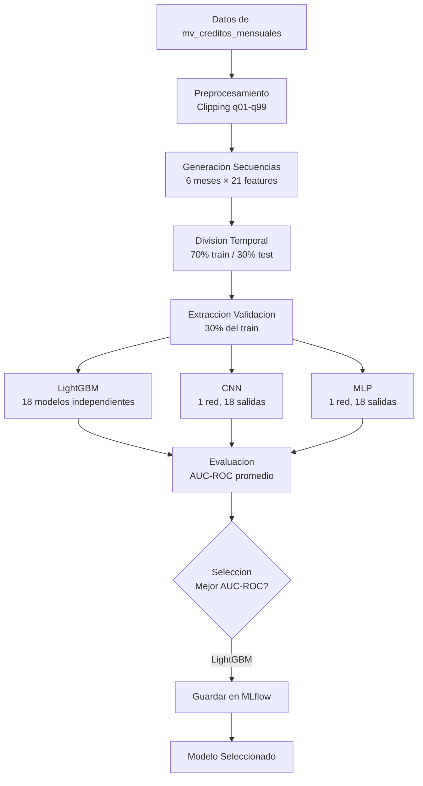

------------------------------------------------------------------------

## 6. Flujo de Inferencia Diaria

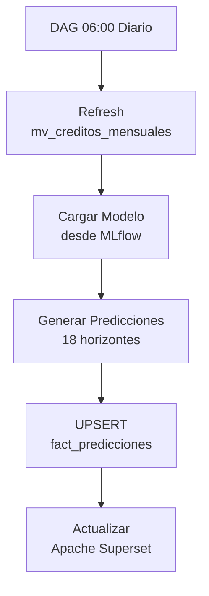

------------------------------------------------------------------------

## 7. Definicion de crisis_flag (8 condiciones)

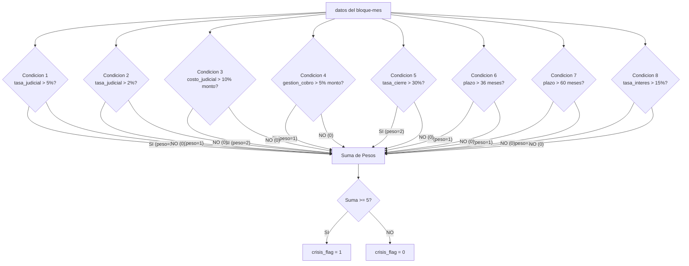

------------------------------------------------------------------------

## 8. Esquema Estrella del Datamart

### 8a. Estrella para fact_creditos_mensual

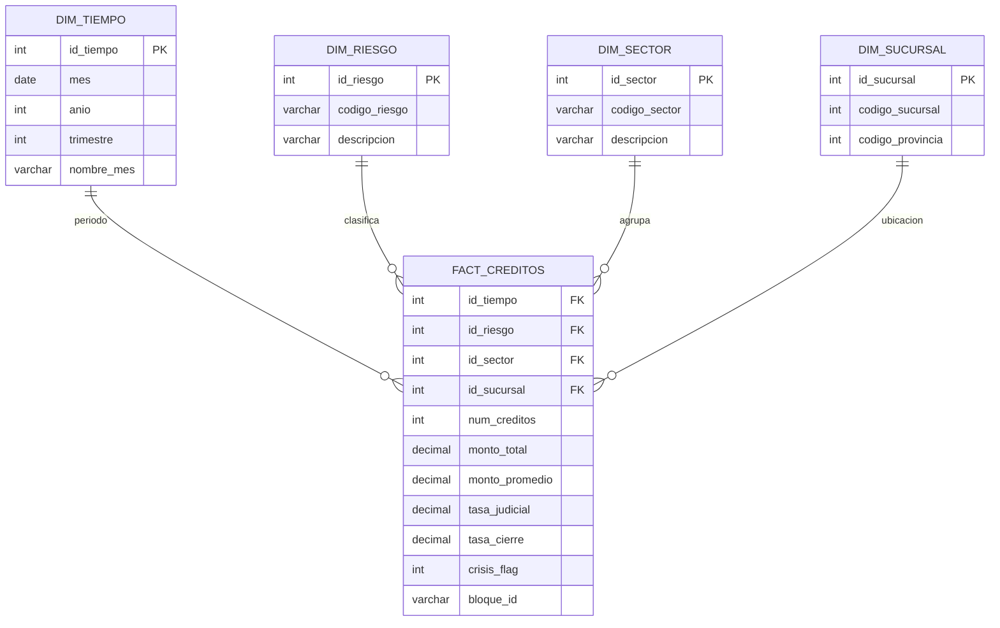

### 8b. Estrella para fact_predicciones

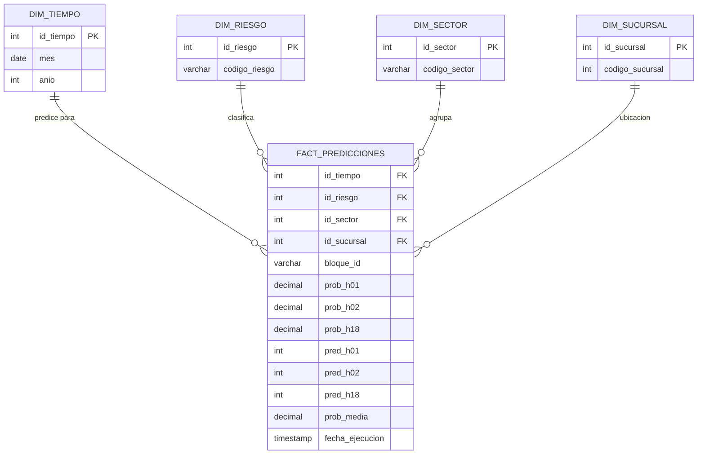

### Diagrama de Integracion (ambos esquemas)

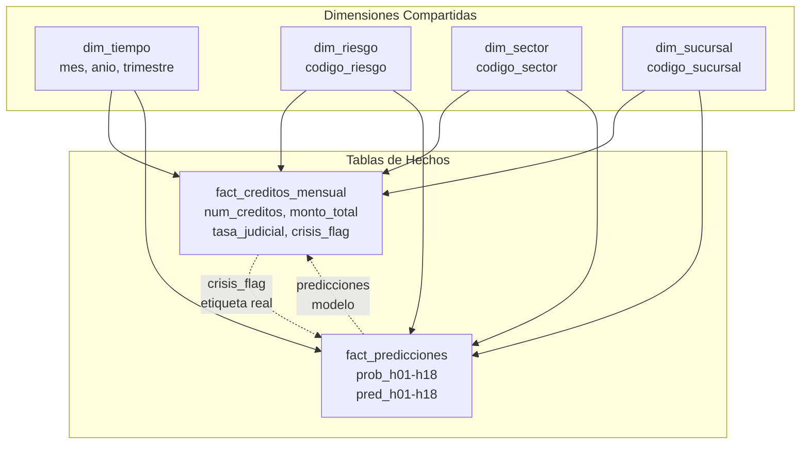

------------------------------------------------------------------------

## Instrucciones para Convertir a Imagenes

### Opcion 1: Mermaid Live Editor (Recomendado)

1.  Ir a https://mermaid.live/
2.  Copiar el codigo de cada diagrama
3.  Pegar en el editor
4.  Exportar como PNG o SVG

### Opcion 2: VS Code

1.  Instalar extension "Mermaid Preview"
2.  Crear archivo .md con los diagramas
3.  Ctrl+Shift+V para previsualizar
4.  Click derecho -\> Export

### Opcion 3: Comando CLI

``` bash
# Instalar mermaid-cli
npm install -g @mermaid-js/mermaid-cli

# Convertir archivo .md a imagenes
mmdc -i diagramas.md -o diagramas.png
```

### Opcion 4: Python con mermaid-py

``` python
import mermaid as md
from mermaid.graph import Graph

graph = Graph("diagram", "graph LR; A-->B")
render = md.Mermaid(graph)
render.to_png("output.png")
```

------------------------------------------------------------------------

## Notas para la Tesis

-   **Formato recomendado**: SVG (vectorial) o PNG de alta resolucion (300 DPI)
-   **Tamano**: Ancho minimo 800px para impresion
-   **Colores**: Usar tonos neutros o sin color para impresion B/N
-   **Leyenda**: Incluir leyenda en cada figura
-   **Caption**: Agregar caption descriptivo debajo de cada imagen